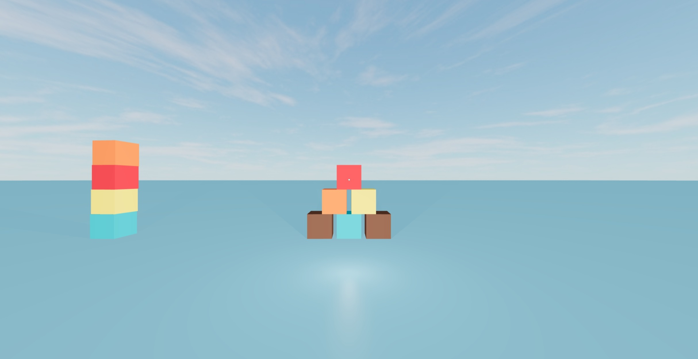
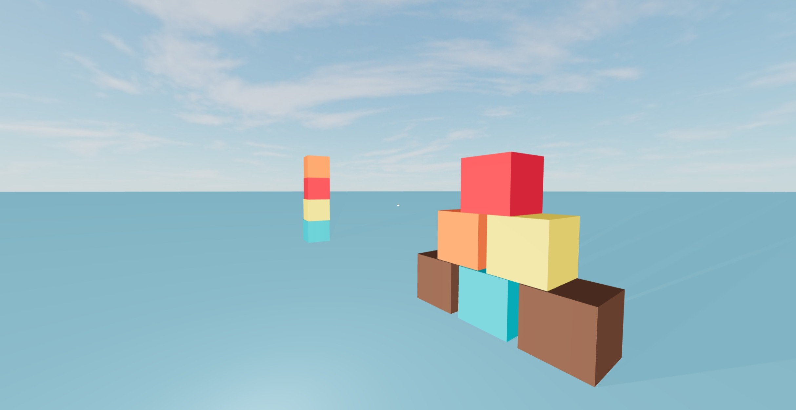

# First Person Shooter in React

First Person Shooter in React using [three.js](https://github.com/mrdoob/three.js/), [react-three-fiber](https://github.com/pmndrs/react-three-fiber) and [@react-three/cannon](https://github.com/pmndrs/use-cannon).

Made for fun.

[Try it on Code Sandbox](https://codesandbox.io/s/first-person-shooter-with-physics-0ylld)

## Screenshots

